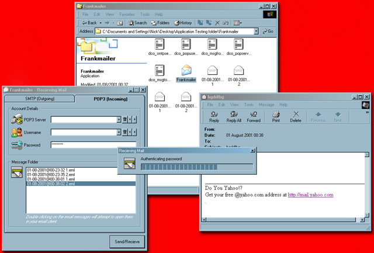



## Frankmailer \*\*UPDATE\*\*

### Description

Frankmailer is a beta mail suite application, it sends and recieves email from SMTP/POP3 servers. I have modified the checkmail routine so it's now even faster. If you haven't downloaded this or even if you have, I reccommend downloading this new version, it's coming along in leaps and bounds and in the next release I hope to have the ability to send attachments with the emails also. Just for reference all downloaded emails are saved in Outlook Express format and attachments can be downloaded perfectly, I have tested it many times and it hasn't fallen over once! Please vote for it, and comment on it!
 
### More Info
 

             |
---                |---
**Submitted On**   |2001-08-01 00:55:42
**By**             |[Niknak\!\!](https://github.com/Planet-Source-Code/PSCIndex/blob/master/ByAuthor/niknak.md)
**Level**          |Advanced
**User Rating**    |4.8 (63 globes from 13 users)
**Compatibility**  |VB 6\.0
**Category**       |[Internet/ HTML](https://github.com/Planet-Source-Code/PSCIndex/blob/master/ByCategory/internet-html__1-34.md)
**World**          |[Visual Basic](https://github.com/Planet-Source-Code/PSCIndex/blob/master/ByWorld/visual-basic.md)
**Archive File**   |[Frankmaile238437312001\.zip](https://github.com/Planet-Source-Code/niknak-frankmailer-update__1-25701/archive/master.zip)

